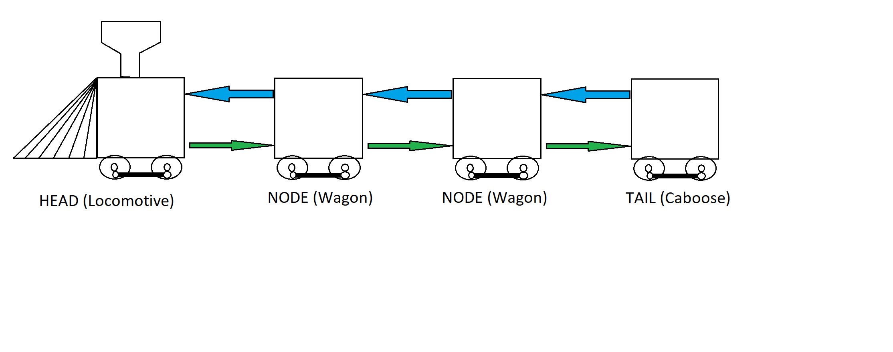
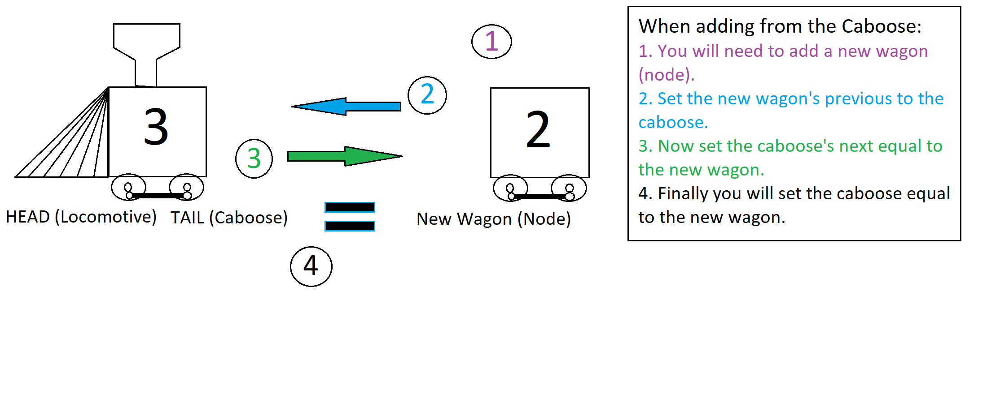
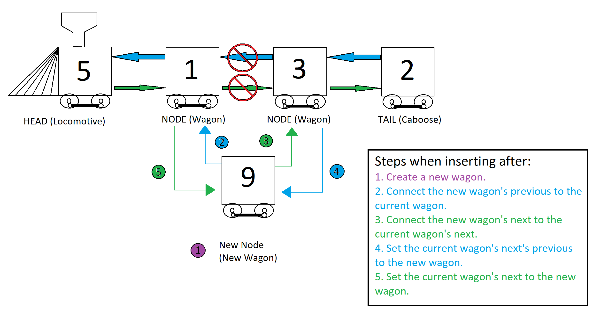

# LINKED LISTS
*	[Introduction](#introduction)
*	[What are Queues used for](#what-are-queues-used-for)
*	[Big O of Queues](#big-o-of-queues)
*	[Example](#example)
*	[Problem to Solve](#problem-to-solve)

## Introduction
With queues everything followed a specific order. Like python lists, they are indexed and you can easily jump to which ever one if you know the index. Linked lists are different, they are not organized into a nice line where you can grab any given one by simply saying the index. Rather the way a linked list works is you have a bunch of nodes and those nodes three things. They contain a link to the next node, a link to the previous node and the data that has been assigned to the given node.

The other thing to note is that a linked list always has a head, the beginning, and it has a tail, the end. A good way to think about lists are like trains. There is the locomotive (head of the train) and the caboose (tail of the train). Each wagon contains people or cargo and each is connected to the next wagon and the previous wagon.

Since there is nothing that comes before the head, the locomotive, the previous of the head is always set to None in python. For the tail, the caboose, the opposite is true, there is nothing that comes after the coboose so next is always set to None as well.

Say we start out with no train. Our Locomotive is set to None, and so is the caboose. Now lets say we want to add some things to our train. We can insert from either the locomotive or the caboose. In python this would look something like this if we had a class Train:
```Python
my_train = Train() # Currently the head and the tail don't have anything in them so everything is set to None.

print(my_train) # Result Train[]
my_train.insert_caboose(3)
print(my_train) # Result Train[3]
my_train.insert_caboose(2)
print(my_train) # Result Train[3]<->[2]
my_train.insert_locomotive(1)
print(my_train) # Result Train[1]<->[3]<->[2]
my_train.insert_locomotive(5)
print(my_train) # Result Train[5]<->[1]<->[3]<->[2]
```

### Insert From the Caboose
Our first insert in this case from the caboose would set the caboose and locomotive both equal to three because if we only have one wagon on the train then it is both the locomotive and the caboose. Next when we insert again from the caboose, the caboose now changes to the value 2 and the locomotive stays as the value 3. These are the steps you would take:
1. You will need to add a new wagon (node).
2. Set the new wagon's previous to the caboose, which is also the locomotive in this case.
3. Now set the caboose's next equal to the new wagon. 
4. Finally you will set the caboose equal to the new wagon.



### Insert From the Locomotive
When you insert from the locomotive it is pretty much the same, but I'll give you the steps.

1. You will need to add a new wagon (node).
2. Set the new wagon's next to the locomotive.
3. Now set the locomotive's previous equal to the new wagon. 
4. Finally you will set the locomotive equal to the new wagon.

This is all fine and dandy if you just want to add to one end or the other, but how would you insert something at a given index? Say from our code above we want to insert a 9 after the wagon holding a 1. This is what the code would look like:
```Python
# Assume this is our train -> Train[5]<->[1]<->[3]<->[2]

# Insert a wagon with a cargo value of 9 after the wagon with the cargo of value 1

my_train.insert_after(1, 9) 
print(my_train) # Result Train[5]<->[1]<->[9]<->[3]<->[2]

```
### Insert After a Given Cargo
How this works is different than how you would insert in a list in pyhon. Since you can't just go to the index that contains 1 you will have to loop through each one until you found the correct value. If the value wasn't in the train then you would need to notify the user once the loop got to the caboose.

Now once you find the value you are looking for these are the steps you would take to insert it. Let's call the wagon you are inserting the new wagon after current.
1. Create a new wagon.
2. Connect the new wagon's previous to the current wagon.
3. Connect the new wagon's next to the current wagon's next.
4. Set the current wagon's next's previous to the new wagon.
5. Set the current wagon's next to the new wagon.

This is what it would look like:


Okay, now we now how to put stuff on our train, but what about if we want to remove from our train?

### Removing From the Caboose
If we ant to remove the caboose from the train the process would be pretty simple. Here is what we would do:
1. Set the caboose equal to the caboose's previous.
2. Now set caboose's next to None.

Since we don't care what happens to whatever the caboose was we can just disconnect it.

### Removing From the Locomotive
The process of removing from the locomotive is pretty much the same as removing frmo the caboose:
1. Set the locomotive equal to the locomotive's next.
2. Now set the locomotive's previous to None.

You would need to make sure that if the wagon you are removing is the last wagon, then set the locomotive and the caboose equal to None.

### Removing From the Middle
Alrighty, so you can remove from the caboose and from the locomotive, but how would we do that if we wanted to remove a wagon from the middle?

To do so is not as complicated as inserting after. Here is what you would do after finding the wagon you want to remove. We'll call it the current wagon:
1. Set the current wagon's previous's next to the current wagon's next.
2. Set the current wagon's next's previous to the current wagon's previous.

That's only two steps, way less then inserting after.

## What are Queues used for


## Big O of Queues


## Example


## Problem to Solve


### Task 1:


### Task 2: