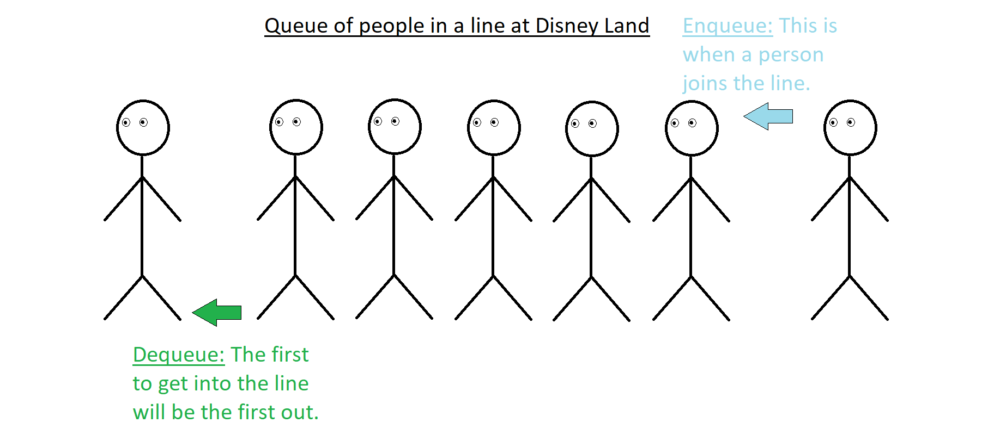

# QUEUE
*	[Introduction](#introduction)
*	[What are Queues used for](#what-are-queues-used-for)
*	[Big O of Queues](#big-o-of-queues)
*	[Example](#example)
*	[Problem to Solve](#problem-to-solve)

## Introduction
Queues are like a list of items or people in a line. They follow and have an order into they way they are put in and taken out which goes as First In, First Out (FIFO). 

Say that our queue is like a line of people at Disney Land. The first person in the line is the first one to be admitted onto the ride or into Disney Land, this is the same way that a queue works.

## What are Queues used for

## Big O of Queues

## Example

## Problem to Solve