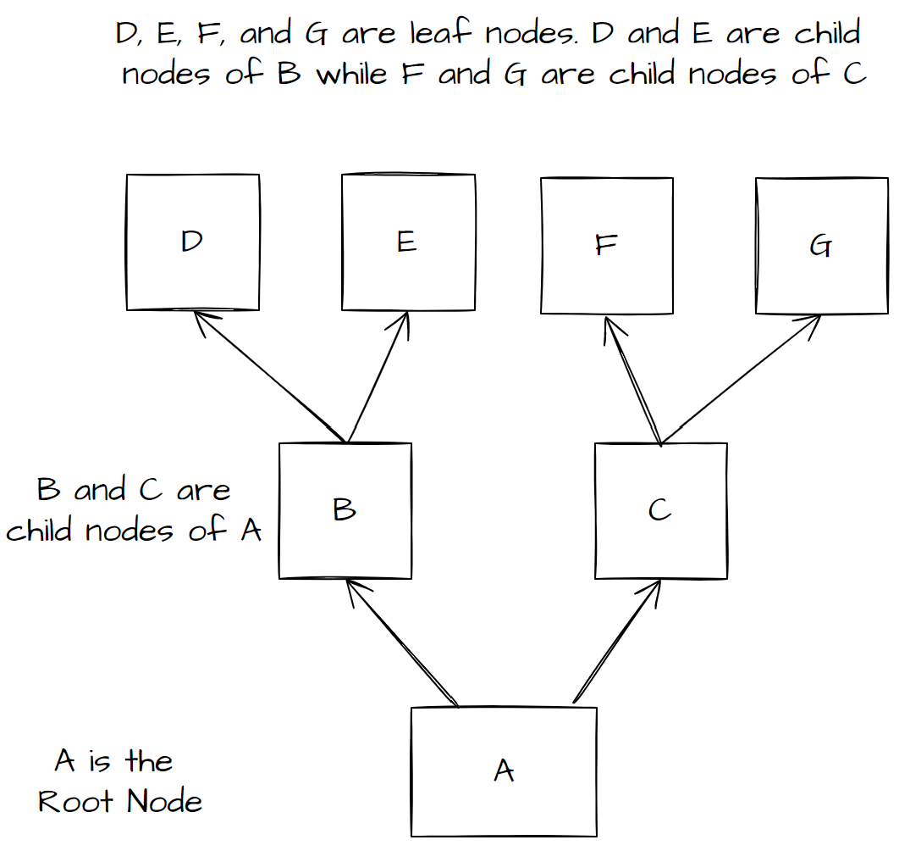
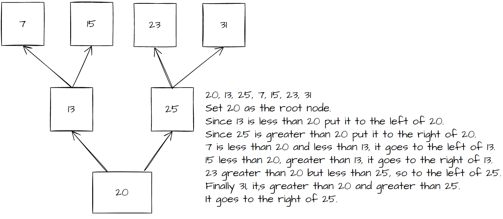
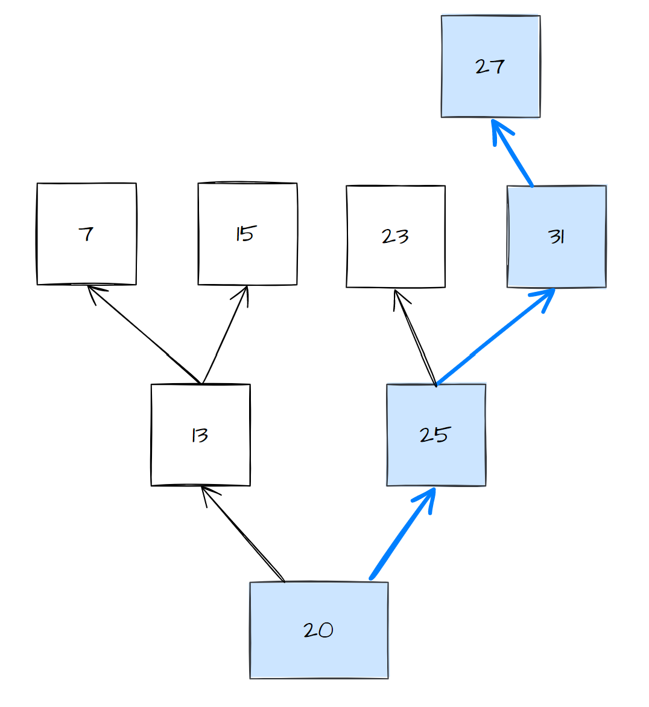
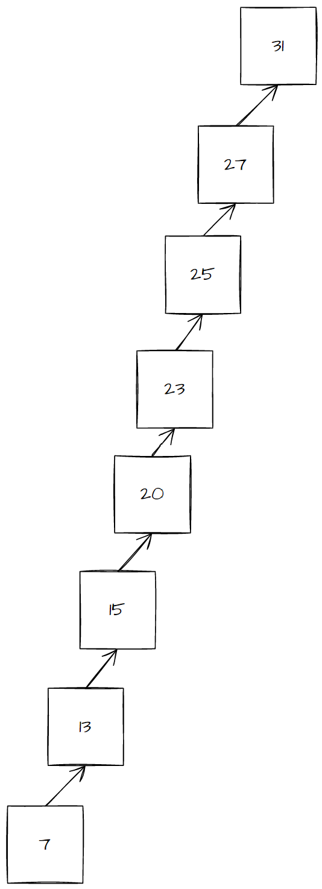
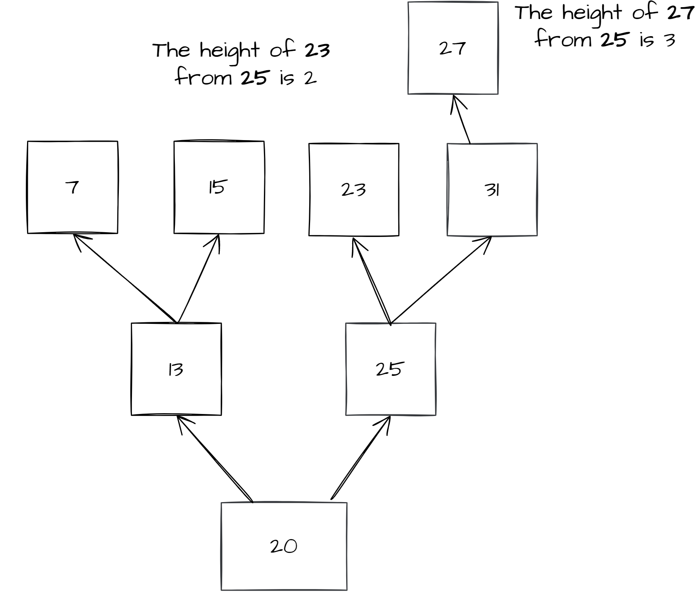
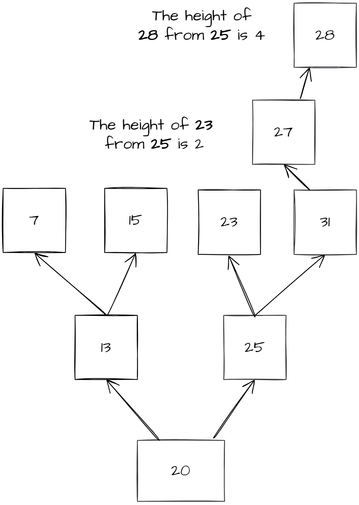
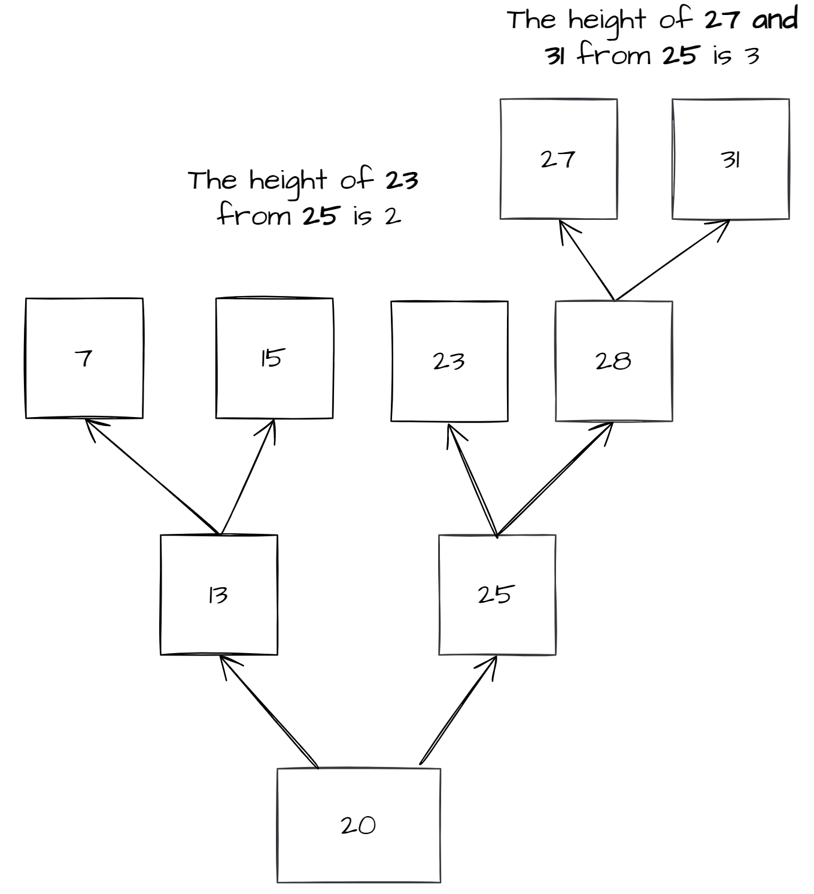

# TREES
*	[Introduction](#introduction)
*	[What are Trees](#what-are-trees)
*	[Big O of Trees](#big-o-of-trees)
*	[Example](#example)
*	[Problem to Solve](#problem-to-solve)


## Introduction
Trees are the final data structure we will be talking about. Though to be honest I would think of them more as roots of a tree. Trees are very similar to linked lists. Each node is connected to the next, however when we talked about linked lists we talked about the doubly-linked lists. Trees are like singly linked lists in that they only go in one direction. Each node is connected to the next node. But trees can have varying amounts of nodes that they are connected to, these nodes are called child nodes. I will only talk about binary trees, binary search trees and balanced binary search trees here, but there are different types of trees.


## What Are Trees

Trees start with a root node which is connected to its child nodes and each of those child node can have its own child nodes. Here is an example of a **binary tree**.



In a binary tree every node will have at most two child nodes. Some may have only one and others may have none. If a child node has none than it is called a leaf node. In the picture you can see that nodes D, E, F and G are leaf nodes because they have no children.

Trees can be useful for storing items data in that you want sorted. Say that you have as list of numbers that you want to put into your list. You can use a binary search tree. Take this list of numbers
[20, 13, 25, 7, 15, 23, 31] and  follow these steps:
1. starting with the first number we set it as our root node. 
2. Then to insert the next number we check if it is greater then the current node, in this case the root node. If the value is less than the current node we will go to the left, if it is greater we put it to the right. 
3. Repeat step 2 until you run out of child nodes. In that case set it as your current's child node.

This is what it would look like:



Following this process we are able to have a sorted binary tree.

Say for example we wanted to insert the value 27 into the balanced tree above. To do so we would follow the same process. Is 27 less or greater than 20. Since it is greater go to the right. Is 27 less or greater than 25. It is greater, go to the right. Is 27 less or greater than 31. It's less than and since 31 doesn't have a child to the left we will put it there.



If we had don this with a dynamic array or a linked list the process would have taken 7 comparisons which would have been O(n), but using a binary search tree it only took us 4 comparisons. When we insert using a balanced binary search tree it has a performance of O(log(n)). It is very similar to the binary search algorithm. If you don't know what that is you can read more about it [here.](https://en.wikipedia.org/wiki/Binary_search_algorithm)

Now if we entered a list of numbers like this [7,13,15,20,23,25,27,31] into our binary tree it would look a bit different and not be as effective for finding/inserting values. This is what it would look like.



The big O of a tree like the one above would be O(n) because at that piont it is pretty much a singly linked list. This is an unbalanced binary search tree.

To count the height of a subtree of a given node you start at one beginning at that given node and count how many levels deep it goes. The unbalanced tree above has a height of 8. But the balanced tree we showed just before has a height of 4 that's because we start at the root node if we are counting its height for the whole tree. The left side though has a height of 3, the right side has the height of 4.

A balanced binary search tree is one where there is not a large difference in height between the subtrees of a given node. One of the most common algorithms is the AVL (ADelson-Velskii and Landis) trees. In an AVL the height of any two subtrees of a given node is no more than two if we are the node itself as one.

In this example here the tree would still be balanced.



But if we were to add a number like 28. It would no longer be balanced because 28 would be 4 away from 25 while 23 is still a height of 3 away.



So to fix this we would move 28 to 31, that way the tree remains balanced. Each time there is an insertion or deletion an avl tree would update it. This is what the resulting tree would look like.


## Big O of Trees
Each time we insert, remove or check for an item it will be O of log(n) because with each comparison we remove a subtree effectively cutting our items to check in half.

If the Binary Search Tree is balanced here is what the Big O would be

Task | Description | Big O
---------------|-------------------|---------------
insert(value) | Inserting a value into the BST | O(log(n))
remove(value) | Removing a value from the BST  | O(log(n))
contains(value) | Checking if the specified value exists in the BST | O(log(n))
traverse_forward | Go through all of the nodes starting with the left-most node going to the right | O(n) Because we have to check every node
traverse_backward | Go through all of the nodes starting with the right-most node going to the left | O(n) Because we have to check every node
height() | Check to see which has the longest sub-tree and how long it is. | O(n) Because every node is checked
size() | This is constantly updated | O(1)
empty() | Check if size() is equal to 0 | O(1)

## Example

**Binary Search Tree Functions**
The construction of a BST is like a Train or linked list, though instead of linking to the previous node we are linking to the right and left. So while the parent is linked to the children, you can't go from the child to the parent node.

**Insert**
To insert into the BST we will use recursion.

* Base case: If the current node doesn't have a subtree in the place we need to put it, be that to the right or left. Otherwise keep going deeper
* Smaller problem: Insert the value eather to the right or to the left subtree, depending on what the current value is.

In the code below BST is the name of the class, and BST.Node is the name of the Node class inside of the BST class.
Node has three things in it. It has data(the value of the node), left(this points to the left subtree), and right(this points to the right subtree)

Here is what the code would look like, they would be methods of the BST class:

```Python
def insert(self, value):
    """
    Put the value into the BST. As a special case if the BST is empty we will set the root equal to a new node and put the value in that. If it is empty then we will recursively look for a  place to put the value.
    """
    if self.root == None:
        self.root = BST.Node(value)
    else:
        self._insert(value, self.root) # Initiate the recursive function starting at the root.

def _insert(self, value, node):
    """
    Recursively look for a place to put the node with the value in it. Here node is the subtree we are looking at. 
    """
    if value == node.value:
        # If the value is already in the tree then 
        # get out of the function
        return
    elif value < node.value:
        # The value will go to the left.
        if node.left == None:
            # This means we can place it here
            node.left = BST.Node(value)
        else:
            # Keep looking recursing down the left subtree
            self._insert(value, node.left)

    else value >= node.value:
        if node.right == None:
            #Yay we found an empty spot
            node.right = BST.Node(value)
        else:
            # Keep looking recursing down the right subtree
            self._insert(value, node.right)

```

I will show you how to traverse a BST backwards. To do so you will need to visit every node, if you were traversing forward you would use the __iter__ funciton. This is recognized in python for whenever you want to loop through something. For example when you write **for num in numbers** you are using the __iter__ function on numbers. In this case we will be using the __reversed__ function which does the same thing but loops through it backwards. In the code **yield** is used to give the next value to the for loop. This is similar to the return except that the **yield** will allow the funciton to continue from where it left off. To give a value from the generator funciton we can use the **yield from** keywords.

Here is what our code would look like:
```Python
    def __reversed__(self):
        """
        Perform a formward traversal (in order traversal) starting from 
        the root of the BST.  This function is called when a the 
        reversed function is called and is frequently used with a for
        loop.

        for value in reversed(my_bst):
            print(value)

        """        
        yield from self._traverse_backward(self.root)  # Start at the root

    def _traverse_backward(self, node):
        """
        This moves backward though the list and because we are yielding the value in the node after doing a funciton to traverse from the right we will be starting with the largest numbers first then we will do it from the left side

        This function is to be called by the __reversed function__        
        """
        if node is not None:
            yield from self._traverse_backward(node.right)
            yield node.value
            yield from self._traverse_backward(node.left)
```

As a hint for one of your tasks you will need to do something similar to traverse forward through the BST. You will have to use the __iter__ function.

Here is the sample code you should use:

```Python
class BST:
    """
    This BST, binary search tree data structure uses a node class inside of it.
    You will call BST.Node to create a node. All of the attributes are inside of the Node class, while all of the methods are found in the BST class.
    """

    class Node:
        """
        This node class, it has a left, right and value
        """
        def __init__(self, value):
            
            self.value = value
            self.left = None
            self.right = None
    
    def __init__(self):

        self.root = None
    
    def insert(self, value):
        """
        Put the value into the BST. As a special case if the BST is empty we will set the root equal to a new node and put the value in that. If it is empty then we will recursively look for a  place to put the value.
        """
        if self.root == None:
            self.root = BST.Node(value)
        else:
            self._insert(value, self.root) # Initiate the recursive function starting at the root.

    def _insert(self, value, node):
        """
        Recursively look for a place to put the node with the value in it. Here node is the subtree we are looking at. 
        """
        if value == node.value:
            # If the value is already in the tree then 
            # get out of the function
            return
        elif value < node.value:
            # The value will go to the left.
            if node.left == None:
                # This means we can place it here
                node.left = BST.Node(value)
            else:
                # Keep looking recursing down the left subtree
                self._insert(value, node.left)

        else:
            if node.right == None:
                #Yay we found an empty spot
                node.right = BST.Node(value)
            else:
                # Keep looking recursing down the right subtree
                self._insert(value, node.right)

    def __contains__(self, value):
        """ 
        Look to see if value is in the BST
        This is like saying:
        4 in my_bst
        """
        return self._contains(value, self.root)  # Start at the root

    ################
    # Begin Task 1 #
    ################
    def _contains(self, value, node):
        """
        This checks if your BST contains value.
        this is to be used by __contains__
        """
        # If it is in the current node then return the node
        if value == node.value:
            return True
        elif value == node.value:
            if node.left is not None:
                return self._contains(value, node.left) # Check if the value is in the left subtree
        else:
            if node.right is not None:
                return self._contains(value, node.right) # Check if the value is in the right subtree

        # If you couldn't find it using the previous cases return False
        return False
    ##############
    # END Task 1 #
    ##############
    
    def __iter__(self):
        """
        Perform a forward traversal (in order traversal) starting from 
	    the root of the BST.  This is called a generator function.
        This function is called when a loop	is performed:

        for value in my_bst:
            print(value)

        """
        yield from self._traverse_forward(self.root)  # Start at the root
    
    ################
    # Begin Task 2 #
    ################
        
    def _traverse_forward(self, node):
        """
        This moves forward though the bst yielding the value in the node after doing a funciton to traverse from the left we will be starting with the lowest numbers first then we will do it from the right side

        """
        pass
        
    ##############
    # END Task 2 #
    ##############


    def __reversed__(self):
        """
        Perform a backward traversal this will call the  _traverse_backward fuction

        for value in reversed(my_bst):
            print(value)

        """        
        yield from self._traverse_backward(self.root)  # Start at the root

    def _traverse_backward(self, node):
        """
        This moves backward though the list and because we are yielding the value in the node after doing a funciton to traverse from the right we will be starting with the largest numbers first then we will do it from the left side

        This function is to be called by the __reversed function__        
        """
        if node is not None:
            yield from self._traverse_backward(node.right)
            yield node.value
            yield from self._traverse_backward(node.left)

    def get_height(self):
        """
        Determine the height of the BST.  Note that an empty tree
        will have a height of 0 and a tree with one item (root) will
        have a height of 1.
        
        If the tree is empty, then return 0.  Otherwise, call 
        _get_height on the root which will recursively determine the 
        height of the tree.
        """
        if self.root is None:
            return 0
        else:
            return self._get_height(self.root)  # Start at the root

    ################
    # Begin Task 3 #
    ################
    def _get_height(self, node):
        """
        Figure out the height of the BST. You will add 1
        to whichever subtree is bigger, be that the right or to the left.
        A hint for this task is that you may want to think about comparing the left side with the right side to see which is bigger so keep track of their values.
        """
        pass

    
    ##############
    # END Task 3 #
    ##############

```
## Problem to Solve
### Task 1
```Python
t = BST()
t.insert(9)
t.insert(10)
t.insert(12)
t.insert(1)
t.insert(8)
t.insert(6)

print("Task 1")
print(9 in t) # True
print(7 in t) # False
print(1 in t) # True
print(13 in t) # False
print(14 in t) # False
print(6 in t) # True
```
### Task 2
```Python
print("Task 2")
for x in t:
    print(x) # 1 6 8 9 10 12
```

### Task 3
```Python
print("Task 3")
print(t.get_height()) # 4
t.insert(12)
print(t.get_height()) # 4
t.insert(5)
print(t.get_height()) # 5
```
Go [here](trees_solution.py) to compare your solution.
